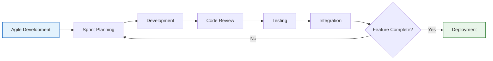

# JanConnect Technical Approach - Visual User Journey# JanConnect Technical Approach - User Journey Flowchart


## 🎯 Complete Session Flow (Login → Logout)## Complete User Session Journey (Login to Logout)


**Problem Statement:** Mapping of Implementing and Executing Agencies across PM-AJAY Components**Problem Statement:** Mapping of Implementing and Executing Agencies across PM-AJAY Components


```mermaidThis flowchart illustrates the complete technical user journey from login to logout, showing how different user roles interact with the JanConnect system for mapping and monitoring implementing and executing agencies across PM-AJAY components.

graph TB

    Start([🌐 User Opens Portal]) --> Login[🔐 Login<br/>Email + Password]```mermaid

    graph TB

    Login --> Auth{✅ Valid?}    Start([User Opens<br/>JanConnect Portal]) --> LoginPage[Login Page Displayed]

    Auth -->|❌ No| Error[⚠️ Error Message]    

    Error --> Login    LoginPage --> EnterCreds[User Enters<br/>Email & Password]

        EnterCreds --> Authenticate[JWT Authentication<br/>Backend Verification]

    Auth -->|✔️ Yes| Token[🎫 JWT Token<br/>Generated & Stored]    

        Authenticate --> ValidUser{Valid<br/>Credentials?}

    Token --> Role{👤 User Role?}    ValidUser -->|No| LoginError[Show Error Message]

        LoginError --> LoginPage

    Role -->|🏛️| Admin[MoSJE Admin<br/>📊 National View<br/>👥 All Agencies<br/>📈 Full Access]    

    Role -->|🏢| State[State Admin<br/>📍 State-Specific<br/>➕ Create Projects<br/>🔗 Assign Agencies]    ValidUser -->|Yes| GenerateToken[Generate JWT Token<br/>Store in Redux & localStorage]

    Role -->|👷| Agency[Agency User<br/>📋 Assigned Projects<br/>✅ Update Milestones<br/>📤 Upload Evidence]    

        GenerateToken --> CheckRole{Check User Role}

    Admin --> Dashboard[📊 Dashboard<br/>Stats & Charts]    

    State --> Dashboard    CheckRole -->|MoSJE-Admin| AdminDashboard[National Admin Dashboard<br/>• View all states & agencies<br/>• Monitor all components<br/>• Access all projects]

    Agency --> Dashboard    

        CheckRole -->|State-Admin| StateDashboard[State Admin Dashboard<br/>• View state-specific data<br/>• Manage state agencies<br/>• Create/edit projects]

    Dashboard --> Browse{🔍 User Action?}    

        CheckRole -->|Agency-User| AgencyDashboard[Agency User Dashboard<br/>• View assigned projects<br/>• Update milestones<br/>• Upload evidence files]

    Browse -->|View| Projects[📁 Projects List<br/>Filter & Search]    

    Browse -->|Create| NewProj[➕ New Project<br/>State-Admin Only]    AdminDashboard --> AdminActions[Admin Actions:<br/>• Create new users<br/>• View statistics<br/>• Generate reports<br/>• Monitor all agencies]

        

    Projects --> Detail[📄 Project Details<br/>💰 Financials<br/>🎯 Milestones]    StateDashboard --> StateActions[State Admin Actions:<br/>• Create new projects<br/>• Assign agencies<br/>• Select components<br/>• Monitor state projects]

        

    Detail --> Actions{⚡ Action?}    AgencyDashboard --> AgencyActions[Agency User Actions:<br/>• View project details<br/>• Update milestone status<br/>• Upload evidence<br/>• Add remarks]

        

    Actions -->|Edit| Edit[✏️ Edit Project<br/>State-Admin]    AdminActions --> CommonFeatures[Common Features for All Users]

    Actions -->|Update| Milestone[✅ Update Milestone<br/>Agency User]    StateActions --> CommonFeatures

    Actions -->|View| Continue[👁️ Continue<br/>Browsing]    AgencyActions --> CommonFeatures

        

    Edit --> Save[💾 Save to<br/>MongoDB]    CommonFeatures --> ViewProjects[View Projects Page<br/>• Filter by component<br/>• Filter by state<br/>• Search projects<br/>• View project cards]

    Milestone --> Upload[☁️ Cloudinary<br/>File Upload]    

    Upload --> Save    ViewProjects --> ProjectDetail[Single Project Page<br/>• Project information<br/>• Financial details<br/>• Milestone tracker<br/>• Agency information]

        

    NewProj --> Form[📝 Fill Form:<br/>🏛️ Component<br/>🏢 Agencies<br/>💰 Budget<br/>📍 Location]    ProjectDetail --> UserChoice{User Action?}

    Form --> Save    

        UserChoice -->|Edit Project| EditProject[Edit Project Form<br/>State-Admin only<br/>• Update details<br/>• Modify agencies<br/>• Change component]

    Save --> Success[✔️ Success!<br/>Data Updated]    

    Continue --> Success    UserChoice -->|Update Milestone| UpdateMilestone[Update Milestone<br/>Agency-User access<br/>• Change status<br/>• Upload evidence<br/>• Add completion date]

        

    Success --> More{🔄 Continue<br/>Session?}    UserChoice -->|View Only| ViewMore[Continue Browsing<br/>• View more projects<br/>• Check statistics<br/>• View charts]

        

    More -->|Yes| Browse    EditProject --> SaveChanges[Save to MongoDB<br/>Update Redux State]

    More -->|Logout| Exit[🚪 Logout<br/>Clear Token]    UpdateMilestone --> CloudinaryUpload[Upload to Cloudinary<br/>Store URL in Database]

        CloudinaryUpload --> SaveChanges

    Exit --> End([👋 Session Ended])    

        SaveChanges --> Success[Show Success Message<br/>Refresh Project Data]

    style Start fill:#e8f5e9,stroke:#2e7d32,stroke-width:3px    ViewMore --> Success

    style Login fill:#e3f2fd,stroke:#1565c0,stroke-width:2px    

    style Token fill:#fff3e0,stroke:#f57c00,stroke-width:2px    Success --> ContinueSession{Continue<br/>Session?}

    style Admin fill:#f3e5f5,stroke:#6a1b9a,stroke-width:2px    

    style State fill:#e8eaf6,stroke:#3949ab,stroke-width:2px    ContinueSession -->|Yes, Navigate| ViewProjects

    style Agency fill:#fce4ec,stroke:#c2185b,stroke-width:2px    ContinueSession -->|Yes, Dashboard| CheckRole

    style Dashboard fill:#e0f2f1,stroke:#00695c,stroke-width:2px    ContinueSession -->|No, Logout| Logout[User Clicks Logout]

    style Upload fill:#fff9c4,stroke:#f9a825,stroke-width:2px    

    style Save fill:#c8e6c9,stroke:#388e3c,stroke-width:2px    Logout --> ClearToken[Clear JWT Token<br/>Remove from Redux<br/>Clear localStorage]

    style Exit fill:#ffebee,stroke:#c62828,stroke-width:2px    

    style End fill:#f5f5f5,stroke:#616161,stroke-width:3px    ClearToken --> RedirectLogin[Redirect to Login Page<br/>Session Ended]

```    

    RedirectLogin --> End([User Session Complete])

---    

    style Start fill:#e1f5e1,stroke:#2e7d32,stroke-width:3px

## 🎭 Role-Based Access Matrix    style LoginPage fill:#e3f2fd,stroke:#1565c0,stroke-width:2px

    style Authenticate fill:#fff3e0,stroke:#e65100,stroke-width:2px

```mermaid    style AdminDashboard fill:#f3e5f5,stroke:#6a1b9a,stroke-width:2px

graph LR    style StateDashboard fill:#e8eaf6,stroke:#283593,stroke-width:2px

    subgraph Roles["👥 User Roles"]    style AgencyDashboard fill:#fce4ec,stroke:#ad1457,stroke-width:2px

        A1[🏛️ MoSJE Admin]    style CommonFeatures fill:#e0f2f1,stroke:#00695c,stroke-width:2px

        A2[🏢 State Admin]    style CloudinaryUpload fill:#fff4e6,stroke:#f57c00,stroke-width:2px

        A3[👷 Agency User]    style SaveChanges fill:#f1f8e9,stroke:#558b2f,stroke-width:2px

    end    style Logout fill:#ffebee,stroke:#c62828,stroke-width:2px

        style End fill:#e8f5e9,stroke:#2e7d32,stroke-width:3px

    subgraph Access["🔐 Access Levels"]```

        B1[🌍 National]

        B2[📍 State]---

        B3[📋 Project]

    end## User Journey Breakdown by Role

    

    subgraph Actions["⚡ Permissions"]### 🔐 **Authentication Layer**

        C1[✅ Create<br/>❌ Delete<br/>✏️ Edit<br/>👁️ View]1. User accesses JanConnect portal

        C2[✅ Create<br/>✏️ Edit<br/>👁️ View]2. Login page with email/password fields

        C3[✅ Update<br/>👁️ View]3. JWT token generation upon successful authentication

    end4. Token stored in Redux state and localStorage for persistence

    5. Automatic token validation on protected routes

    A1 --> B1 --> C1

    A2 --> B2 --> C2### 👨‍💼 **MoSJE-Admin Journey**

    A3 --> B3 --> C3**Access Level:** National (All States & Agencies)

    

    style A1 fill:#f3e5f5,stroke:#6a1b9a,stroke-width:2px**Dashboard Features:**

    style A2 fill:#e8eaf6,stroke:#3949ab,stroke-width:2px- Total projects across all states

    style A3 fill:#fce4ec,stroke:#c2185b,stroke-width:2px- Total budget statistics

    style C1 fill:#c8e6c9,stroke:#388e3c,stroke-width:2px- Component-wise distribution charts

    style C2 fill:#fff9c4,stroke:#f9a825,stroke-width:2px- State-wise project breakdown

    style C3 fill:#e1bee7,stroke:#8e24aa,stroke-width:2px

```**Available Actions:**

- Create new users (State-Admin, Agency-User)

---- View all projects nationwide

- Generate comprehensive reports

## 🏗️ System Architecture- Monitor all implementing and executing agencies

- Access financial data across all components

```mermaid

graph TB### 🏛️ **State-Admin Journey**

    subgraph Frontend["🎨 Frontend Layer"]**Access Level:** State-Specific

        F1[⚛️ React.js]

        F2[🗃️ Redux]**Dashboard Features:**

        F3[🎭 Dark Mode]- State-specific project statistics

    end- Budget allocation for the state

    - Component distribution within state

    subgraph Backend["⚙️ Backend Layer"]- Recent projects in the state

        B1[🟢 Node.js]

        B2[🚂 Express.js]**Available Actions:**

        B3[🔐 JWT Auth]- Create new projects for their state

    end- Select component (Adarsh Gram, GIA, Hostel)

    - Assign implementing agency

    subgraph Database["💾 Data Layer"]- Assign executing agency

        D1[🍃 MongoDB]- Set project financials

        D2[☁️ Cloudinary]- Edit existing state projects

    end- View state-level reports

    

    F1 --> B1### 👷 **Agency-User Journey**

    F2 --> B2**Access Level:** Assigned Projects Only

    F3 --> B3

    **Dashboard Features:**

    B1 --> D1- Projects assigned to their agency

    B2 --> D1- Pending milestones requiring attention

    B3 --> D2- Completed vs pending tasks

    - Personal project statistics

    style Frontend fill:#e3f2fd,stroke:#1565c0,stroke-width:2px

    style Backend fill:#fff3e0,stroke:#f57c00,stroke-width:2px**Available Actions:**

    style Database fill:#e8f5e9,stroke:#2e7d32,stroke-width:2px- View assigned project details

```- Update milestone status (Pending → Completed)

- Upload evidence files (Cloudinary integration)

---- Add remarks and completion dates

- Track project progress

## 📊 PM-AJAY Components- View financial allocations


```mermaid---

graph LR

    Central[🏛️ PM-AJAY<br/>Scheme] --> C1[🏘️ Adarsh Gram<br/>Model Villages]## Technical Flow Details

    Central --> C2[💰 GIA<br/>Grant-in-Aid]

    Central --> C3[🏠 Hostel<br/>SC/ST Infrastructure]### � **Project Creation Flow (State-Admin)**

    ```mermaid

    C1 --> A1[🏢 Implementing<br/>Agency]graph LR

    C1 --> A2[👷 Executing<br/>Agency]    A[Click New Project] --> B[Fill Form:<br/>Title, Component,<br/>District, Agencies]

        B --> C[Select Implementing<br/>Agency]

    C2 --> A3[🏢 Implementing<br/>Agency]    C --> D[Select Executing<br/>Agency]

    C2 --> A4[👷 Executing<br/>Agency]    D --> E[Add Financial Details]

        E --> F[Submit Form]

    C3 --> A5[🏢 Implementing<br/>Agency]    F --> G[API: POST /api/projects]

    C3 --> A6[👷 Executing<br/>Agency]    G --> H[Save to MongoDB]

        H --> I[Redirect to<br/>Projects List]

    style Central fill:#f3e5f5,stroke:#6a1b9a,stroke-width:3px    

    style C1 fill:#c8e6c9,stroke:#388e3c,stroke-width:2px    style A fill:#e3f2fd,stroke:#1565c0,stroke-width:2px

    style C2 fill:#fff9c4,stroke:#f9a825,stroke-width:2px    style F fill:#fff3e0,stroke:#e65100,stroke-width:2px

    style C3 fill:#b3e5fc,stroke:#0277bd,stroke-width:2px    style H fill:#e8f5e9,stroke:#2e7d32,stroke-width:2px

    style A1 fill:#ffe0b2,stroke:#e65100,stroke-width:2px```

    style A2 fill:#ffe0b2,stroke:#e65100,stroke-width:2px

    style A3 fill:#ffe0b2,stroke:#e65100,stroke-width:2px### � **Milestone Update Flow (Agency-User)**

    style A4 fill:#ffe0b2,stroke:#e65100,stroke-width:2px```mermaid

    style A5 fill:#ffe0b2,stroke:#e65100,stroke-width:2pxgraph LR

    style A6 fill:#ffe0b2,stroke:#e65100,stroke-width:2px    A[View Project] --> B[Click Upload<br/>Evidence]

```    B --> C[Select File<br/>Max 10MB]

    C --> D[Upload to<br/>Cloudinary]

---    D --> E[Receive File URL]

    E --> F[Update Milestone<br/>Status]

## 🔄 Key Workflows    F --> G[API: PUT /api/projects/:id/milestone/:mid]

    G --> H[Save to MongoDB]

### 📝 Create Project Flow    H --> I[UI Updates<br/>Real-Time]

```mermaid    

graph LR    style A fill:#e3f2fd,stroke:#1565c0,stroke-width:2px

    A[➕ New] --> B[📝 Form]    style D fill:#fff4e6,stroke:#f57c00,stroke-width:2px

    B --> C[🏛️ Component]    style H fill:#e8f5e9,stroke:#2e7d32,stroke-width:2px

    C --> D[🏢 Agencies]```

    D --> E[💾 Save]

    ---

    style A fill:#e3f2fd,stroke:#1565c0,stroke-width:2px

    style E fill:#c8e6c9,stroke:#388e3c,stroke-width:2px## Session Management

```

### 🔑 **Token Lifecycle**

### ✅ Update Milestone Flow1. **Generation**: Upon successful login, JWT token created with 30-day expiration

```mermaid2. **Storage**: Token stored in:

graph LR   - Redux state (for current session)

    A[📋 View] --> B[📤 Upload]   - localStorage (for persistence across browser sessions)

    B --> C[☁️ Cloud]3. **Usage**: Every API request includes token in Authorization header: `Bearer <token>`

    C --> D[✅ Update]4. **Validation**: Backend middleware validates token on each protected route

    D --> E[💾 Save]5. **Expiration**: After 30 days or manual logout, token is cleared

    

    style A fill:#e3f2fd,stroke:#1565c0,stroke-width:2px### 🚪 **Logout Process**

    style C fill:#fff9c4,stroke:#f9a825,stroke-width:2px1. User clicks "Logout" button in header

    style E fill:#c8e6c9,stroke:#388e3c,stroke-width:2px2. Redux action dispatches `logout()`

```3. Clear user data from Redux store

4. Remove token from localStorage

---5. Redirect to login page

6. Session terminated completely

## 🔐 Security Flow

---

```mermaid

graph TB## Navigation Flow Map

    A[🔑 Login] --> B[🎫 JWT<br/>30 Days]

    B --> C[💾 Store<br/>Redux + Local]```mermaid

    C --> D[🔒 Protected<br/>Routes]graph TB

    D --> E{🔍 Valid?}    Login[Login Page] --> Dashboard[Dashboard<br/>Role-Based]

    E -->|✅| F[✔️ Access<br/>Granted]    

    E -->|❌| G[🚫 Denied]    Dashboard --> Projects[Projects List Page<br/>• View all accessible projects<br/>• Filter by component/state<br/>• Search functionality]

    G --> A    

    F --> H[🚪 Logout]    Projects --> SingleProject[Single Project Page<br/>• Project details<br/>• Financial info<br/>• Milestones<br/>• Agencies]

    H --> I[🗑️ Clear<br/>Token]    

        SingleProject --> EditProject[Edit Project<br/>State-Admin only]

    style A fill:#e3f2fd,stroke:#1565c0,stroke-width:2px    SingleProject --> UpdateMilestone[Update Milestone<br/>Agency-User]

    style B fill:#fff3e0,stroke:#f57c00,stroke-width:2px    

    style F fill:#c8e6c9,stroke:#388e3c,stroke-width:2px    EditProject --> SingleProject

    style G fill:#ffcdd2,stroke:#c62828,stroke-width:2px    UpdateMilestone --> SingleProject

    style I fill:#f5f5f5,stroke:#616161,stroke-width:2px    

```    Dashboard --> NewProject[New Project Page<br/>State-Admin only]

    NewProject --> Projects

---    

    Projects --> Dashboard

## ✅ Success Metrics    SingleProject --> Projects

    

| Feature | Status |    Dashboard --> Logout[Logout]

|---------|--------|    Projects --> Logout

| 🏛️ **3 Components** | ✅ Mapped |    SingleProject --> Logout

| 🏢 **Agency Linking** | ✅ Dynamic |    

| 📍 **28 States** | ✅ Covered |    Logout --> Login

| 👥 **3 User Roles** | ✅ RBAC |    

| 🔐 **JWT Security** | ✅ Secure |    style Login fill:#e3f2fd,stroke:#1565c0,stroke-width:2px

| 💾 **MongoDB** | ✅ Optimized |    style Dashboard fill:#f3e5f5,stroke:#6a1b9a,stroke-width:2px

| ☁️ **Cloudinary** | ✅ Integrated |    style Projects fill:#e0f2f1,stroke:#00695c,stroke-width:2px

| 📱 **Responsive** | ✅ All Devices |    style SingleProject fill:#fff4e6,stroke:#f57c00,stroke-width:2px

| 🌓 **Dark Mode** | ✅ Supported |    style Logout fill:#ffebee,stroke:#c62828,stroke-width:2px

```

---

---

*🎯 **Outcome:** Efficient mapping system for implementing and executing agencies across PM-AJAY components with real-time monitoring and transparent governance.*

## Key Technical Features

### 🏗️ **Architecture Components**
- **Frontend**: React.js with Redux Toolkit for state management
- **Backend**: Node.js + Express.js RESTful API
- **Database**: MongoDB with Mongoose ODM
- **File Storage**: Cloudinary for evidence uploads
- **Authentication**: JWT with bcrypt password hashing

### 🔐 **Security Implementation**
- JWT tokens with 30-day expiration
- Role-based route protection
- Password encryption with bcrypt
- Protected API endpoints with authMiddleware
- Input validation and sanitization

### 📊 **Data Management**
- **Agency-Project Relationships**: MongoDB references between collections
- **Component Mapping**: Projects linked to Adarsh Gram, GIA, or Hostel
- **State-Based Access**: Automatic filtering based on user role and state
- **Real-Time Updates**: Redux state synchronization with backend

---

## Implementation Methodology



---

## Success Metrics

| Metric | Target | Achievement |
|--------|--------|-------------|
| **Agency Mapping** | All implementing & executing agencies | ✅ Implemented |
| **PM-AJAY Components** | 3 components (Adarsh Gram, GIA, Hostel) | ✅ Complete |
| **User Roles** | 3 distinct hierarchical levels | ✅ Implemented |
| **Agency-Project Linking** | Dynamic assignment system | ✅ Functional |
| **State Coverage** | All Indian states & districts | ✅ Complete |
| **Real-Time Updates** | Milestone tracking with evidence | ✅ Cloudinary |
| **Authentication** | Secure JWT with role-based access | ✅ Implemented |
| **Database Design** | Normalized agency-project relationships | ✅ MongoDB |
| **Documentation** | Comprehensive flowcharts & guides | ✅ Complete |

---

*This approach ensures efficient mapping and monitoring of implementing and executing agencies across all PM-AJAY components, enabling transparent governance and accountability in the Ministry of Social Justice & Empowerment's development initiatives.*
