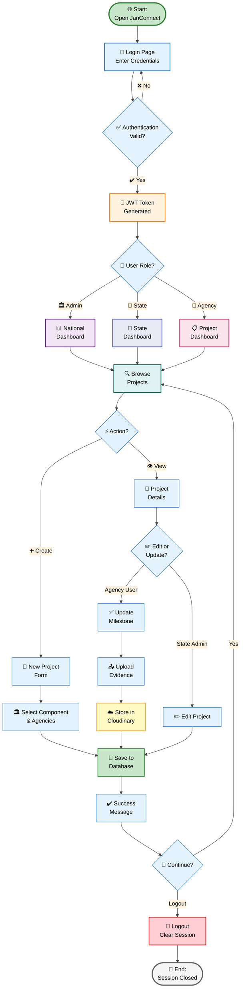

# JanConnect User Workflow - Single Slide Diagram

## 🔄 Complete User Journey (Login to Logout)

**Problem Statement:** Mapping of Implementing and Executing Agencies across PM-AJAY Components

This single, comprehensive flowchart shows the complete user workflow from login to logout in JanConnect system.

---

## 📊 Diagram Summary

**Total Blocks:** 23 nodes (compact and visual)

**Key Components:**
- 🌐 **Entry Point:** User opens portal
- 🔐 **Authentication:** Login with validation
- 👤 **Role Routing:** 3 user types (Admin, State-Admin, Agency-User)
- 📊 **Dashboards:** Role-specific dashboards
- ⚡ **Actions:** Create, View, Edit, Update operations
- 💾 **Data Storage:** MongoDB & Cloudinary
- 🚪 **Exit Point:** Logout and session cleanup

**Color Coding:**
- 🟢 **Green:** Start/End points & Success
- 🔵 **Blue:** Authentication & Navigation
- 🟠 **Orange:** Token & Processing
- 🟣 **Purple:** Admin operations
- 🔴 **Pink:** Agency operations
- 🟡 **Yellow:** Cloud services

---

## 🎯 Workflow Steps

1. **Login (Blocks 1-4):** User authentication with JWT token generation
2. **Role-Based Routing (Blocks 5-8):** Three different dashboards based on role
3. **Project Browse (Block 9):** Central hub for all users
4. **Action Selection (Block 10):** Create new or view existing projects
5. **Project Creation (Blocks 11-13):** Form filling, component selection, save
6. **Project View (Block 12):** Display project details
7. **Modification (Blocks 14-19):** Edit project or update milestones with evidence upload
8. **Cloud Storage (Block 19):** Cloudinary integration for files
9. **Success & Loop (Blocks 20-21):** Confirmation and continue/logout choice
10. **Logout (Blocks 22-23):** Session termination and cleanup

---

*This single flowchart is optimized for PowerPoint presentations and GitHub preview, providing a complete overview of the JanConnect user workflow in one visual diagram.*
